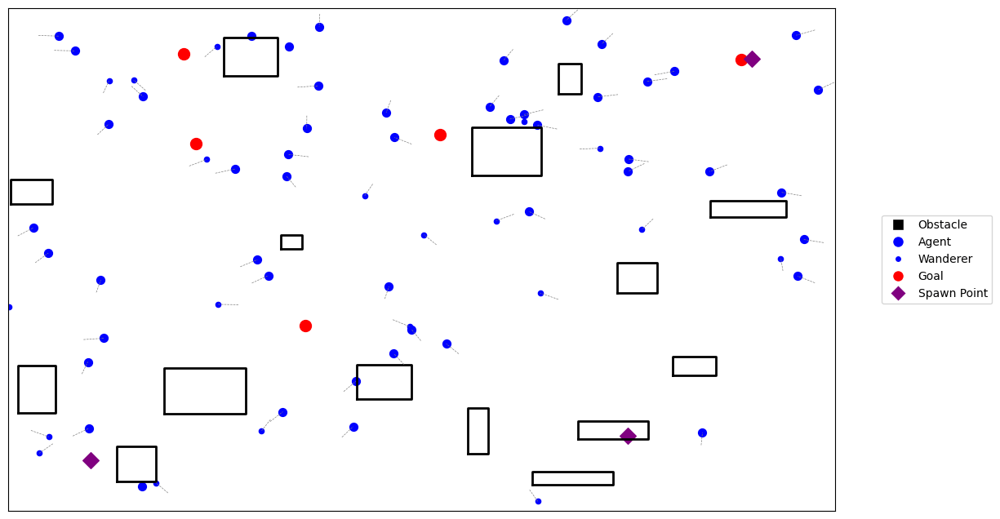
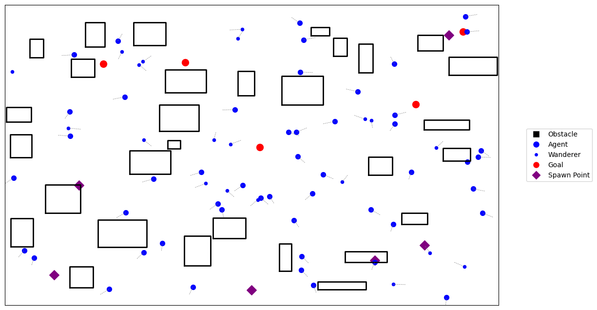
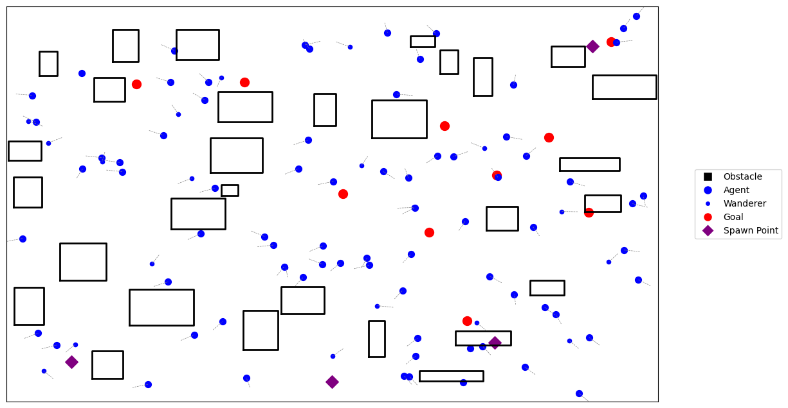

# **Assignment 4: Agent-Based Model Documentation**

## **Table of Contents**

- [Pseudo-Code](#pseudo-code)
- [Technical Explanation](#technical-explanation)
- [Design Variations](#design-variations)
- [Challenges and Solutions](#challenges-and-solutions)
- [References](#references)

---

## **Pseudo-Code**

### **Main Simulation Loop**

1. **Initialize the Environment**:
   - Create an `Environment` object with defined width, height, obstacles, and goals.
   - Generate obstacles using `create_obstacles()`.
   - Generate goals using `create_goals()` and ensure they are valid positions.

2. **Initialize Agents**:
   - Create instances of the `Agent` class:
     - Assign goals to regular agents.
     - Assign behavior flags for `wanderer`, `group_seeker`, or `path_follower` agents.
     - Randomly initialize agent positions within the environment.

3. **Simulation Loop** (for a specified number of steps):
   - **Update Agents**:
     - For each agent:
       - Compute its velocity based on:
         - Avoidance of obstacles.
         - Interaction with neighbors (if applicable).
         - Goal-seeking (if a goal is assigned).
       - Update the agent's position based on its velocity.
       - Check if the agent has reached its goal.
   - **Add New Agents** (every 10 steps):
     - Spawn additional agents at predefined spawn points with new goals.
   - **Visualize the Environment**:
     - Plot obstacles, goals, agents, and spawn points.
     - Save or display the current state of the simulation.

---

### **Agent Class**

1. **Attributes**:
   - `position`: The agent's current position in space.
   - `velocity`: The agent's velocity vector.
   - `goal`: The assigned target position (optional for certain behaviors).
   - `wanderer`, `group_seeker`, `path_follower`: Flags determining the agent's behavior type.
   - `personal_space`: Minimum distance the agent maintains from others.

2. **Methods**:
   - `compute_velocity(neighbors, environment)`:
     - Calculates the agent's velocity based on:
       - Obstacle avoidance.
       - Group-seeking or random wandering behavior (if applicable).
       - Goal-seeking forces.
   - `avoid_obstacles(environment)`:
     - Adjusts the velocity to steer away from obstacles in the agent's path.
   - `steer_around_obstacle(obstacle)`:
     - Calculates a repulsion force to navigate smoothly around an obstacle.
   - `move()`:
     - Updates the agent's position based on its velocity.
   - `reached_goal()`:
     - Checks if the agent is within a threshold distance of its assigned goal.

---

## **Technical Explanation**

### **Object-Oriented Design**

- **Classes**:
  - The simulation uses `Environment` and `Agent` classes to encapsulate core functionality.
  - The `Environment` class handles spatial boundaries, obstacles, and goals.
  - The `Agent` class models individual entities with distinct attributes and behaviors.

- **OOP Principles**:
  - **Encapsulation**:
    - The `Environment` and `Agent` classes contain their specific attributes and methods, separating responsibilities.
  - **Polymorphism**:
    - Agents exhibit different behaviors (wandering, group-seeking, path-following) based on flags.
  - **Reusability**:
    - The modular design allows new agent types or behaviors to be added without altering the existing structure.

---

### **Agent Behaviors and Interactions**

1. **Obstacle Avoidance**:
   - Agents predict their next position and adjust velocity if an obstacle is detected in the path.
   - A steering function ensures smooth navigation around obstacles.

2. **Goal-Seeking**:
   - Agents calculate the direction and distance to their goal.
   - Velocity is adjusted to move toward the goal with a weighted force.

3. **Group-Seeking**:
   - Agents compute the center of nearby agents and adjust velocity to align with the group's position.

4. **Random Wandering**:
   - Wanderer agents move in random directions within the environment.

---

### **Simulation Loop**

- The simulation runs for a fixed number of steps.
- Each step updates all agents based on their behaviors and visualizes the environment's state.
- New agents are spawned periodically to simulate dynamic entry into the environment.

---

## **Design Variations**

### **Variation 1**

#### **Parameters Changed**:
- **num_agents**: 50 (Total number of agents in the simulation)
- **num_wanderers**: 20 (Number of agents with random wandering behavior)
- **num_obstacles**: 15
- **goals**: 5
- **spawn_points**: 3
- **personal_space**: 1.5

#### **Visualization**:

---

### **Variation 2**

#### **Parameters Changed**:
- **num_agents**: 50 (Total number of agents in the simulation)
- **num_wanderers**: 20 (Number of agents with random wandering behavior)
- **num_obstacles**: 30
- **goals**: 5
- **spawn_points**: 6
- **personal_space**: 1.5

#### **Visualization**:

---

### **Variation 3**

#### **Parameters Changed**:
- **num_agents**: 75 (Total number of agents in the simulation)
- **num_wanderers**: 20 (Number of agents with random wandering behavior)
- **num_obstacles**: 30
- **goals**: 10
- **spawn_points**: 4
- **personal_space**: 1.5

#### **Visualization**:

---

## **Challenges and Solutions**

1. **Challenge**: Efficiently managing large numbers of agents.
   - **Solution**: Used a simple neighbor-detection approach with a distance threshold to reduce computation for interactions.

2. **Challenge**: Agents getting stuck in obstacles.
   - **Solution**: Improved obstacle avoidance with predictive steering and repulsion forces.

3. **Challenge**: Visualizing dynamic behaviors in real time.
   - **Solution**: Optimized Matplotlib rendering and paused briefly between steps for smooth animations.

4. **Challenge**: Issues with Grasshopper input. Ensuring that Grasshopper inputs were in the correct format for the simulation (e.g., coordinates, parameters).
   - **Solution**: After encountering difficulties with input compatibility, decided not to use Grasshopper and proceeded with a standalone Python implementation.

5. **Challenge**: Balancing goal-seeking and obstacle avoidance forces.The force driving agents toward their goals was stronger than the repulsion force from obstacles, leading to unrealistic behavior near obstacles.
   - **Solution**: Adjusted the weights of these forces but acknowledged that some issues still remain, particularly near sharp obstacle boundaries.

6. **Challenge**: Deciding which behaviors to implement for realistic simulations of people in public spaces. Determining which behaviors were essential to capture realistic interactions (e.g., avoiding collisions, group dynamics, goal-seeking).
   - **Solution**: Focused on a subset of behaviors deemed most important (e.g., group-seeking, goal-seeking, obstacle avoidance), leaving room for further expansion in future iterations.

---

## **References**

- **Object-Oriented Programming**:
  - [Python Official Documentation](https://docs.python.org/3/tutorial/classes.html)
  - [Real Python - OOP in Python](https://realpython.com/python3-object-oriented-programming/)

- **Agent-Based Modeling**:
  - [Mesa: Agent-Based Modeling in Python](https://mesa.readthedocs.io/en/master/)

- **Visualization Tools**:
  - [Rhino.Python Guides](https://developer.rhino3d.com/guides/rhinopython/)
  - [Grasshopper Official Documentation](https://www.grasshopper3d.com/page/getting-started-with-grasshopper)
  - [matplotlib](https://matplotlib.org/)